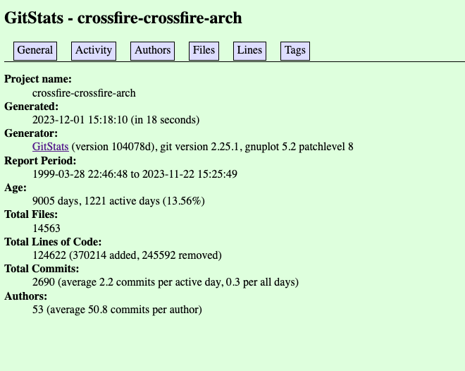
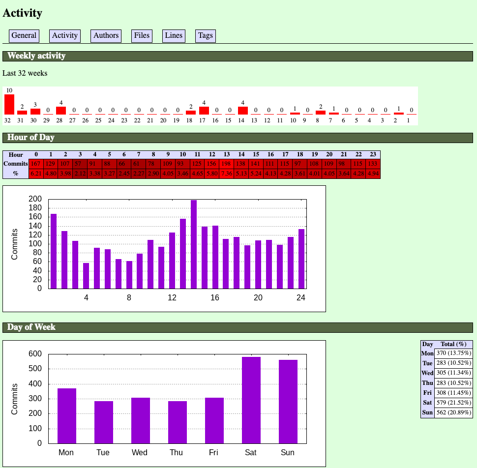
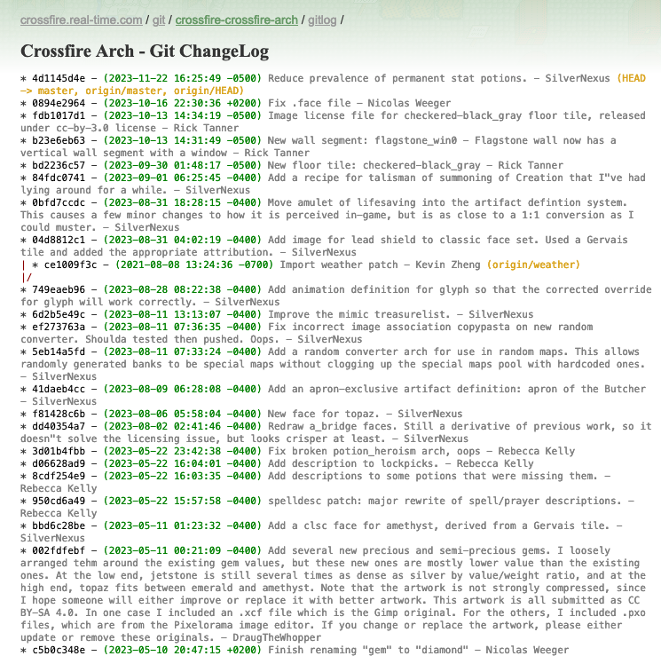

# Crossfire Code Reports

## Description

The project contains multiple scripts to collection reports on various code repositories related to [Crossfire](https://sourceforge.net/projects/crossfire/).

`gitstats_summary.sh` is a bash script that runs `gitstats` for various Crossfire code repositories, saves the output to the website directory, and provides a summary of the execution time.

`gitlog_summary.sh` is a bash script that runs `git-log-html` for various Crossfire code repositories, saves the output to the website directory, and provides a summary of the execution time.

## Installation

It is helpful to have `git` installed to download all the related code for `Crossfire Code Reports`.

### Requirements

`gitstats_summary.sh` requires [gitstats](https://github.com/ari3s/gitstats) to be installed along with `Git`, `Python`and `Gnuplot`.

`gitlog_summary.sh` requires [git-log-html](https://github.com/dhamidi/git-log-html) to be installed and also requires `Git`.

## Guidelines

### Description: Questions to Consider


## Usage

### GitStats

I am using a forked version of [GitStats](https://github.com/tannerrj/gitstats) and a forked version of [GitLog](https://github.com/tannerrj/git-log-html)

The scripts also require a local copy of the code repo. For instance:

``` shell

git clone https://git.code.sf.net/p/crossfire/crossfire-arch crossfire-crossfire-arch

```

#### Running Gitstats:

General example

``` shell

./path/to/gitstats /path/to/local/git-repo /path/to/output/directory

```

Specific example

``` shell

./gitstats/gitstats crossfire-crossfire-arch /var/www/html/crossfire-website/git/crossfire-crossfire-arch/gitstats

```

#### Running GitLog:

General example

``` shell

path/to/git-log-html > file-output-name.html

```

Specific example

``` shell

git-log-html > crossfire-crossfire-arch.html

```

## Screenshot

* Crossfire Archtypes GitStats Index Page

* Crossfire Archtypes GitStats Activity Page

* Crossfire Archetypes Git ChangeLog


## Live Web Page

 * Crossfire [GitStats](https://crossfire.real-time.com/git/gitstats/index.html)
 * Crossfire [GitLog](https://crossfire.real-time.com/git/gitlog/index.html)

## Contributing

 * Contributions are welcome.
 * Pull requests are welcome.
 * Creating a fork on this code base is also welcome.

## Questions

I can be reached via [tannerrj GitHub Profile](https://github.com/tannerrj)

## License:

MIT License

## Crossfire Social Media Links

 * [Facebook](https://www.facebook.com/crossfireproject/)
 * [Mastodon](https://mastodon.social/@crossfiremrpg)
 * [X (Formerly Twitter)](https://twitter.com/crossfiremrpg/)